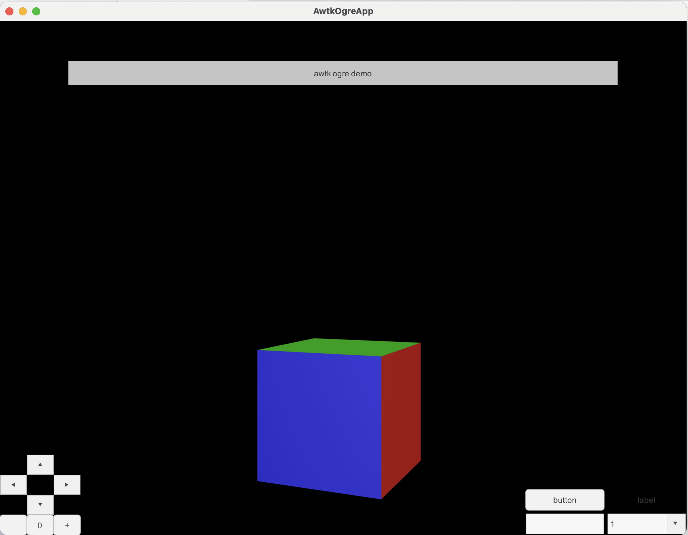

# AWTK 集成 OGRE3D

本项目演示了如何在 AWTK 中集成 [OGRE3D](https://www.ogre3d.org/)。



## 0. 准备

* 先编译 AWTK, 并在 env.sh 中设置 awtk 的路径。
* 需要安装 [cmake](https://cmake.org/)

## 1. 生成资源
  
```shell
python scripts/update_res.py all
```


## 2. 编译

* 设置环境变量

```shell
source env.sh
source env_rt.sh
```

* 编译 ogre 库

```shell
cd 3rd
build_assimp.sh
build_ogre.sh 
build_assimp.sh
```

* 编译 awtk-ogre 库和 demo
  
```shell
./build.sh
```

## 2. 运行

```shell
./bin/demo
```

## 注意

Windows 下需要在下面的配置文件中修改Video Mode为指定分辨率，默认分辨率有问题。

~/Documents/AwtkOgreApp/ogre.cfg

```
Render System=OpenGL 3+ Rendering Subsystem

[OpenGL 3+ Rendering Subsystem]
Colour Depth=32
Debug Layer=Off
Display Frequency=N/A
FSAA= 4
Full Screen=No
Reversed Z-Buffer=No
Separate Shader Objects=Yes
VSync=Yes
VSync Interval=1
Video Mode=1024 x 768
sRGB Gamma Conversion=No
```

